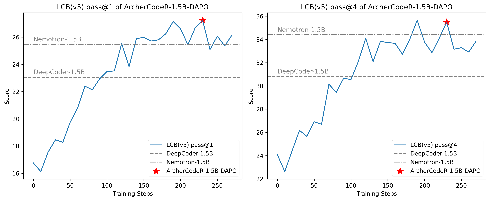

<div align="center">

# ✨ ArcherCodeR

<div>
🏹️  Reinforcement Learning for Enhanced Code Reasoning in LLMs  🎯
</div>

</div>
<div>
<br>

<div align="center">

[](https://github.com/wizard-III/ArcherCodeR)
[](https://huggingface.co/wizardII/ArcherCodeR-1.5B)
[](https://huggingface.co/datasets/wizardII/ArcherCodeR-Dataset)
[](https://wandb.ai/wangjkpkucs-peking-university/ArcherCodeR?nw=nwuserwangjkpkucs)
[](https://zhuanlan.zhihu.com/p/1918765619614057424)

</div>

## Overview

The Archer series focuses on research into RL algorithms and training for medium and small-scale models, aiming to deepen the community's understanding of the fundamental principles of reinforcement learning (RL) on large language models (LLMs). All released content will be comprehensively open-sourced to advance community research development.

<div align="center">


<sub>ArcherCodeR-1.5B-DAPO achieves progressive improvements on LiveCodeBench (LCB), reaching 27.24% LCB score.</sub>
</div>

**ArcherCodeR** is an open-source initiative enhancing code reasoning in large language models through scalable, rule-governed reinforcement learning. We provide full-stack reproducibility including:

- Training code and pipelines
- Curated datasets
- Trained models
- Complete training logs

**Current Models**:
- **[ArcherCodeR-1.5B-DAPO](https://huggingface.co/wizardII/ArcherCodeR-1.5B-DAPO)** - achieves state-of-the-art performance on code tasks (LiveCodeBench) among comparable-scale models (excluding our final ArcherCodeR-1.5B). All training components for this model are now fully released.
- **[ArcherCodeR-1.5B](https://huggingface.co/wizardII/ArcherCodeR-1.5B)** - SOTA among similarly-sized models (training pipeline releasing progressively)

## Evaluation

Performance on LiveCodeBench. The Pass@1 metric represents the average performance across 4 independent sampling attempts. To ensure consistency, we re-evaluated all comparable open-source models using identical evaluation scripts and parameters (temperature=0.8, max_gen_length=32k).

The detailed results are shown in the table below.

| Model                                         | LCB (8/1/24-2/1/25)(Pass@1) | LCB (8/1/24-2/1/25)(Pass@4) |
| --------------------------------------------- | --------------------------- | --------------------------- |
| DeepSeek-R1-Distill-Qwen-1.5B                 | 16.9                        | —                           |
| DeepSeek-R1-Distill-Qwen-1.5B(Tested)         | 16.40                       | 25.81                       |
| DeepCoder-1.5B                                | 25.1                        | —                           |
| DeepCoder-1.5B(Tested)                        | 23.03                       | 30.82                       |
| Nemotron-Research-Reasoning-Qwen-1.5B         | 23.81                       | —                           |
| Nemotron-Research-Reasoning-Qwen-1.5B(Tested) | 25.45                       | 34.40                       |
| **ArcherCodeR-1.5B-DAPO**                     | 26.70                       | 36.56                       |
| **ArcherCodeR-1.5B(32k)**                     | 28.49                       | 38.71                       |
| **ArcherCodeR-1.5B(48k)**                     | 29.30                       | 39.07                       |

Note:
1. Evaluation variance for the same model is typically within ±0.5 across multiple runs.
2. DeepCoder consistently scored around 23 in our tests - lower than its reported performance.
3. NVIDIA's Nemotron-Research-Reasoning-Qwen-1.5B slightly outperformed its reported score, potentially due to different parameter settings in their original evaluation.

## Getting Started

### Installation

```bash
# Installing Python 3.10 Environment.
conda create -n archer python=3.10 -y
conda activate archer

# Installing dependencies.
pip install torch==2.5.1 --index-url https://download.pytorch.org/whl/cu124
wget -nv https://github.com/Dao-AILab/flash-attention/releases/download/v2.7.3/flash_attn-2.7.3+cu12torch2.5cxx11abiFALSE-cp310-cp310-linux_x86_64.whl
pip install --no-cache-dir flash_attn-2.7.3+cu12torch2.5cxx11abiFALSE-cp310-cp310-linux_x86_64.whl

cd ArcherCodeR
pip install -e .
```

### Data Preparation

Download the training and test data from Hugging Face.

```bash
python tools/download_datasets.py
```

#### Initialize Ray Cluster

We have provided a one-click script to initialize Ray environments on any number of machines. Run the following command on the head node:

```bash
bash ./tools/start_ray.sh
```

Note: Hostfile locations vary across operating systems (e.g., on my machine, it's located at /etc/mpi/hostfile). Locate the file on your server and modify its content accordingly.

### Training

We have currently only provided the script and data to reproduce the results of the “ArcherCodeR-1.5B-DAPO”.

```bash
bash ./scripts/train/run_dapo_qwen2.5_1.5b_code.sh
```

### Evaluation

#### Step 1: Convert model format

Run the following command to convert the model to Hugging Face format:

```bash
bash ./tools/model_merge.sh
```

#### Step 2: Run evaluation

Execute the script below to evaluate model performance on the LiveCodeBench v5 benchmark:

```bash
bash ./scripts/eval/run_eval.sh
```

Note: Please update the path parameters in the scripts above as needed.

## Technical Report

Coming soon.

## Acknowledgements

- We build our model upon [`DeepSeek-R1-Distill-Qwen-1.5B`](https://huggingface.co/deepseek-ai/DeepSeek-R1-Distill-Qwen-1.5B).
- Training was carried out with a modified version of [verl](https://github.com/volcengine/verl).

